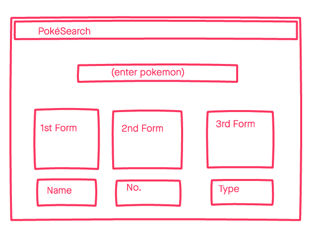

# PokéFinder

Simple App to allow user to search any Pokémon with details on their type, Pokédex number, as well as their image. *Going to continue to add content over time. Taken inspiration from Serebii.net

# ⚙️ Technologies Used

* HTML
* CSS 
* JavaScript
* jQuery
-[Pokemon API](https://pokeapi.co/)
* Github  

# 📸 Screenshots

# 🏃‍♂️ Starting Out

[Click](#) here to get started and see the app online!

# 🔮 Future Updates

* Gives more detailed info about Pokemon
* Location based on the game youre playing
* Movset for each Pokemon form 
* Add correct data
* Add all forms
